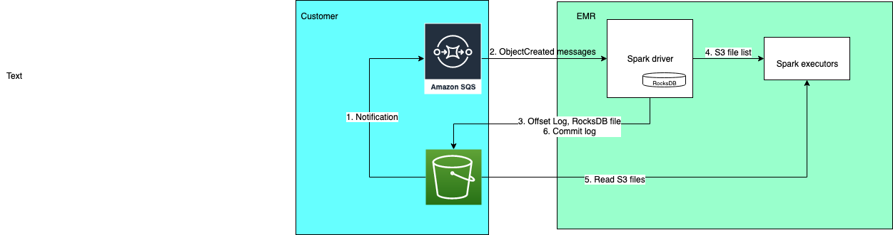

# Apache Spark Structure Streaming S3 Connector

An Apache Spark Structure Streaming S3 connector for reading S3 files using Amazon S3 event notifications to AWS SQS.

## Archicture Overview



1. Configure [Amazon S3  Event Notifications](https://docs.aws.amazon.com/AmazonS3/latest/userguide/NotificationHowTo.html) to send `s3:ObjectCreated:*` events with specified prefix to SQS
2. The S3 connector discovers new files via `ObjectCreated` S3 events in AWS SQS. 
3. The files' metadata are persisted in RocksDB in the checkpoint location together with Spark Structure streaming engine maintained offset. This ensures that data is ingested exactly once. (End to end exactly once requires the data sink to be idempotent.)
4. Driver distributes the S3 file list to executors
5. Executors read the S3 files
6. After successful data sink processing, Spark Structure streaming engine commit the batch

## How to build
**Prerequisite**: [install Rocksdb](https://github.com/facebook/rocksdb/blob/main/INSTALL.md)

Clone spark-sql-kinesis from the source repository on GitHub.

```
mvn clean install -DskipTests
```
This will create *target/spark-streaming-sql-s3-connector-<versiion>.jar* file which contains the connector code and its dependencies. The jar file will also be installed to local maven repository.

Current version is compatible with spark 3.2 and above.

## How to test

* To run the unit tests
  ```
  mvn test
  ```

* To run the integration tests
  * Export the following environment variables with your values:
  ```
  export AWS_ACCESS_KEY_ID="<your AWS access key id>"
  export AWS_SECRET_ACCESS_KEY="<your AWS secret access key>"
  export AWS_REGION=<AWS region to run the integration test>
  
  export TEST_UPLOAD_S3_PATH=<s3 path to upload test s3 files - s3:// >
  export TEST_REGION=<AWS Region of SQS>
  export TEST_QUEUE_URL=<SQS URL - e.g. https://sqs.us-east-2.amazonaws.com/<accountid>/<queuename>>

  export CROSS_ACCOUNT_TEST_UPLOAD_S3_PATH=<cross account s3 path to upload test s3 files - s3:// >
  export CROSS_ACCOUNT_TEST_REGION=<cross account SQS Region>
  export CROSS_ACCOUNT_TEST_QUEUE_URL=<cross account SQS URL>
  ```
  * run `mvn test -Pintegration-test` or `mvn test -Pintegration-test -Dsuites='it.spark.sql.streaming.connector.S3ConnectorSourceSqsRocksDBItSuite'` (S3ConnectorSourceSqsRocksDBItSuite only )

To setup cross account access: (following assumes S3 connector runs in account A to access S3 and SQS in account B)

1. Add following to account B's S3 bucket policy
```json
{
    "Version": "2012-10-17",
    "Statement": [
        {
            "Sid": "cross account bucket",
            "Effect": "Allow",
            "Principal": {
                "AWS": [
                    "arn:aws:iam::<account A id>:user/<account A user name>"
                ]
            },
            "Action": [
                "s3:GetLifecycleConfiguration",
                "s3:ListBucket"
            ],
            "Resource": "arn:aws:s3:::<account B bukcet name>"
        },
        {
            "Sid": "cross account object",
            "Effect": "Allow",
            "Principal": {
                "AWS": [
                    "arn:aws:iam::<account A id>:user/<account A user name>"
                ]
            },
            "Action": [
                "s3:*"
            ],
            "Resource": "arn:aws:s3:::<account B bukcet name>/*"
        }
    ]
}
```

2. Create a new SQS queue and add following to SQS access policy
```json
    {
      "Sid": "__crossaccount_statement",
      "Effect": "Allow",
      "Principal": {
        "AWS": [
          "arn:aws:iam::<account A id>:user/<account A user name>"
        ]
      },
      "Action": [
        "sqs:ChangeMessageVisibility",
        "sqs:DeleteMessage",
        "sqs:GetQueueAttributes",
        "sqs:PurgeQueue",
        "sqs:ReceiveMessage",
        "sqs:SendMessage"
      ],
      "Resource": "<account B SQS ARN, e.g. arn:aws:sqs:us-west-2:xxx:news3filequeue>"
    }
```

3. Configure account B's S3 bucket to send event notifications to the new SQS queue

## How to use

After the connector jar is install in local Maven repository, configure your project pom.xml (use Maven as an example ):

```xml
<dependency>
    <groupId>com.amazonaws</groupId>
    <artifactId>spark-streaming-sql-s3-connector</artifactId>
    <version>{version}</version>
</dependency>
```

Code example

```scala
import com.amazonaws.spark.sql.streaming.connector.S3ConnectorSourceOptions._

val connectorOptions = spark.sqlContext.getAllConfs ++ Map(
  QUEUE_REGION -> "<AWS Region of SQS>",
  S3_FILE_FORMAT -> "csv",
  MAX_FILES_PER_TRIGGER -> "500",
  MAX_FILE_AGE->"15d",
  QUEUE_URL -> "<SQS URL - e.g. https://sqs.us-east-2.amazonaws.com/<accout id>/<queue name> >",
  QUEUE_FETCH_WAIT_TIMEOUT_SECONDS -> "10",
  SQS_LONG_POLLING_WAIT_TIME_SECONDS -> "5",
  SQS_VISIBILITY_TIMEOUT_SECONDS -> "60",
  PATH_GLOB_FILTER -> "*.csv",
  PARTITION_COLUMNS -> "valPartition",
  BASE_PATH -> "root path of S3 files"
)

val testSchemaWithPartition: StructType = StructType(Array(
  StructField("valString", StringType, nullable = true),
  StructField("valBoolean", BooleanType, nullable = true),
  StructField("valDouble", DoubleType, nullable = true),
  StructField("valInt", IntegerType, nullable = true),
  StructField("valPartition", StringType, nullable = false),
))

val inputDf = spark
  .readStream
  .format(SOURCE_SHORT_NAME)
  .schema(testSchemaWithPartition)
  .options(connectorOptions)
  .load()
```

A full running example is at `src/test/scala/pt/spark/sql/streaming/connector/DataConsumer.scala` which is included in `spark-streaming-sql-s3-connector-<version>-tests.jar`.

Use following command to submit to Spark on Amazon EMR (Assume `spark-streaming-sql-s3-connector-<version>.jar` and `spark-streaming-sql-s3-connector-<version>-tests.jar` are copied to EMR master node and under current directory).

```bash
spark-submit --class pt.spark.sql.streaming.connector.DataConsumer --deploy-mode cluster --jars spark-streaming-sql-s3-connector-<version>.jar spark-streaming-sql-s3-connector-<version>-tests.jar  <s3 new file root path> <SQS URL> csv <checkpoint location> <s3 path to write result>
```
This application receives s3 event notfication from `<SQS URL>`, reads the new files from `<s3 new file root path>` and save the result to `<s3 path to write result>`.  

If run with OSS Spark, `spark-submit` needs to add s3a related configurations, e.g.

```
--conf spark.hadoop.fs.s3.impl=org.apache.hadoop.fs.s3a.S3AFileSystem --conf spark.hadoop.fs.s3a.aws.credentials.provider=com.amazonaws.auth.EnvironmentVariableCredentialsProvider
```

Note: `spark.hadoop.fs.s3.impl` instead of `spark.hadoop.fs.s3a.impl` is used so that s3a can read `s3://` prefixed file paths.

Run below to generate the S3 test files to be consumed by `pt.spark.sql.streaming.connector.DataConsumer`

```bash
spark-submit --class pt.spark.sql.streaming.connector.DataGenerator --jars ~/spark-streaming-sql-s3-connector-<version>-SNAPSHOT.jar ~/spark-streaming-sql-s3-connector-<version>-SNAPSHOT-tests.jar <s3 new file root path> <number of rows to generate> <number of partitions> <partition prefix string>
```

## How to configure
Spark Structure Streaming S3 connector supports the following settings.

Name | Default                                 | Description
--- |:----------------------------------------| ---
spark.s3conn.fileFormat| required, no default value              |file format for the s3 files stored on Amazon S3
spark.s3conn.queueRegion| required, no default value              |AWS region where queue is created
spark.s3conn.queueUrl| required, no default value              |SQS queue url, e.g. https://sqs.us-east-1.amazonaws.com/<account_id>/<queue_name>
spark.s3conn.queueType/required, SQS| only support SQS                        
spark.s3conn.queueFetchWaitTimeoutSeconds| requred, 2 * longPollingWaitTimeSeconds |wait time (in seconds) for fetching messages from SQS at each trigger. Message fetching is finished either messages fetched is greater than maxFilerPerTrigger or queueFetchWaitTimeoutSeconds expires.
spark.s3conn.maxFilesPerTrigger| required,100                            |maximum number of files to process in a microbatch. -1 for unlimited
spark.s3conn.maxFileAge| required,15d                            |maximum age of a file that can be stored in RocksDB. Files older than this will be ignored.
spark.s3conn.pathGlobFilter| optional                                |only include S3 files with file names matching the pattern.
spark.s3conn.partitionColumns| optional                                |comma seperated partition columns. Partition columns must be defined in the schema.  Use together with "basePath" option to read from S3 folder with partitions. For example, for file s3://<testbucket>/testdatarootpath/part1=A/part2=B/testdata.csv, set "spark.s3conn.partitionColumns" -> "part1,part2", "basePath" -> "s3://<testbucket>/testdatarootpath/"
spark.s3conn.reprocessStartBatchId| optional                                |start batch id for a reprocess run (inclusive). Note: a reprocess run will not consume new messages in SQS.
spark.s3conn.reprocessEndBatchId| optional                                |end batch id for a reprocess run (inclusive)
spark.s3conn.reprocessDryRun| optional,true                           |a dry run to list all the files to be reprocessed.
spark.s3conn.sqs.longPollingWaitTimeSeconds| 10                                      |wait time (in seconds) for SQS client long polling
spark.s3conn.sqs.maxConcurrency| 50                                      |number of parallel connections to Amazon SQS queue
spark.s3conn.sqs.maxRetries| 10                                      |maximum number of consecutive retries in case of a SQS client connection failure before giving up
spark.s3conn.sqs.visibilityTimeoutSeconds| 60                                      |SQS message visibility timeout
spark.s3conn.sqs.keepMessageForConsumerError| false                                   |when set to true, the invalid messages with following reasons in SQS will be kept 1. the file is expired 2. the file doesn't match glob pattern 3. the file is already processed and persisted in RocksDB. This can be used with DLQ when for debug purpose

## How to use S3 event notifications for multiple applications

If one S3 path's event notifications need to be consumed by multiple Spark Structure Streaming applications, SNS can be used to fanout to Amazon SQS queues. The message flow is S3 event notifications -> SNS -> SQS. When an S3 event notification is published to the SNS topic, Amazon SNS sends the notification to each of the subscribed SQS queues.

## Security

See [CONTRIBUTING](CONTRIBUTING.md#security-issue-notifications) for more information.

## Acknowledgement

Reference implementation [Apache Bahir Spark SQL Streaming Amazon SQS Data Source](https://github.com/apache/bahir/tree/master/sql-streaming-sqs).

RocksDB related code is reusing the work done by [Apache Spark](https://github.com/apache/spark).
